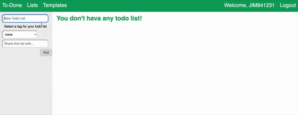
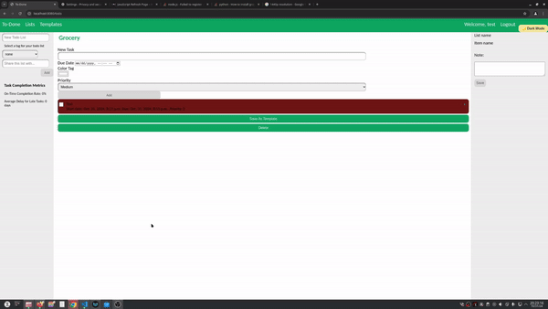
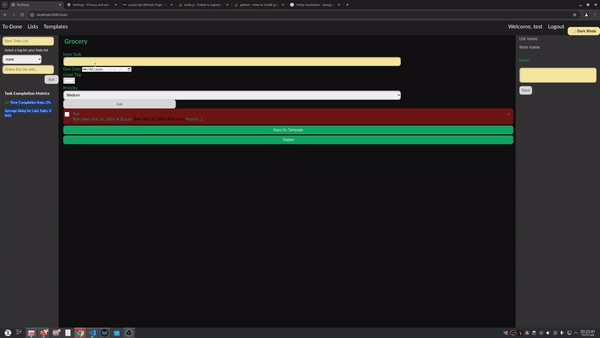
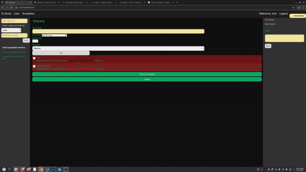
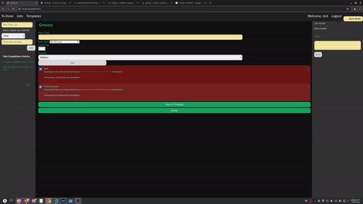

x<p align="center">
  
</p>
<h2 align="center">The Only Todo List You Need</h2>

[](https://coveralls.io/github/vatsal-dp/To-Done?branch=main)
[]([https://github.com/vatsal-dp/To-Done/actions/workflows/pylint.yml])
[](https://github.com/CSC510-Team-57/To-Done/blob/main/LICENSE)
[](https://www.python.org/downloads/release/python-380/)
[](https://docs.djangoproject.com/en/4.1/releases/4.1/)
[](https://doi.org/10.5281/zenodo.14226147)

# TO-DONE

`to-done` lets you manage your todo list effectively with minimal effort. With a minimalistic web interface,
you can access your todolist on the go. Use our rich library of templates to create a new todo list very fast or create your own.

### Watch this video to know more about TO-DONE 4.0

https://user-images.githubusercontent.com/23623764/205810552-556e0449-3f81-4e55-ad9a-414de9731b15.mp4

### Watch this video to know more about the original TO-DONE


# Contents

- [Why?](#why)
- [Features](#key-features-last-version)
- [New Features](#new-features)
- [Upcoming Features](#upcoming-features)
- [Quick Start](#quick-start)
- [Documentation](#Documentation)
- [Want to contribute?](#want-to-contribute)
- [License](#license)
- [Developer](#developers-new-version)

### Why?

We wanted to work on something that is:

- Useful, serves some real purpose
- Easy to start with a basic working version and lends itself to adding new features incrementally to it
- Easily divisible in modules/features/tasks that can be parallely done by five developers
- Diverse enough so that a lot of Software Engineering practices is required/involved

`to-done` is a todo list app that is actually useful, very easy to create a basic working version with where a ton of new features can be added, touches upon all the aspects of web programming, database, working in a team etc.

### Key Features (Previous Versions Version)

- [Register](#register)
- [Login](#login-forget-password)
- [Create, Update, Delete Todo Lists](#manage-todo-list)
- [Quickly Create Todo Lists From Existing Templates](#templates)
- [Create Your Own Templates](#templates)
- [Shared List](#shared-todo-lists)
- [Add Due Date To Tasks](#due-date-color-tags)
- [Due Date Alerting Mechanism](#due-date-color-tags)
- [Add Reminder Message to task completed](#due-date-color-tags)
- [Customized Color Tag](#due-date-color-tags)
- [Add Tags To Todo Lists For Customizable Grouping](#customizable-grouping-tags)
- [Notifications](#notifications)
- [On-time metrics](#on-time-metrics)
- [Tasks sorted by due date](#tasks-sorted-by-due-date)
- [Dark Mode](#dark-mode)
- [Priority Tracker](#priority)

### New Features

- [Fixed Daylight saving time](#fixed-daylight-saving-time)
- [Email Notification](#email-notification)
- [Add list in Google Calendar](#add-list-in-google-calendar)
- [Shared Lists](#shared-list)
- [UI Improvements](#ui-improvements)

### Upcoming Features

- Containerization
- User Authentication via OTP
- Progress Tracking
- Mobile App Browser Extension

### Quick Start

- [Download](https://www.python.org/downloads/release/python-380/) and install Python 3.8.0 or higher
- [Install](https://docs.djangoproject.com/en/4.1/topics/install/) Django 4.1
- Clone the repository
  ```bash
   https://github.com/vatsal-dp/To-Done.git
  ```
- Update migrations
  ```bash
   python manage.py makemigrations
  ```
- Run migrations
  ```bash
   python manage.py migrate
  ```
- Start the app
  ```bash
   python manage.py runserver 8000
  ```
- Point your browser at localhost:8000 and explore the app

### Documentation

[See this page](https://chloe-ku.github.io/smart-todo/)

### Features

#### Register

<p float="middle">
    
</p>

#### Login, Forget Password

<p float="middle">
     
</p>

#### Manage Todo List

<p float="middle">
    
    <br>
    <br>
    
</p>

#### Templates

<p float="middle">
    
</p>

#### Customizable Grouping Tags

<p float="middle">
    
</p>

#### Shared ToDo Lists

<p float="middle">
    
</p>

#### Due Date, Color Tags

<p float="middle">
    
</p>

### New Features

#### Notifications

<p float="middle">
    
</p>

#### Dark Mode

<p float="middle">
    
</p>

#### Tasks Sorted By Due Date

<p float="middle">
    
</p>

#### On Time Metrics

<p float="middle">
    
</p>

#### Priority

<p float="middle">
    
</p>

### Want to Contribute?

Want to contribute to this project? Learn about [Contributing](CONTRIBUTING.md). Found a bug or have a new feature idea? Please create an [Issue](https://github.com/CSC510-Team-57/To-Done/issues) to notify us.

### License

Distributed under the MIT License. See [LICENSE](LICENSE) for more information.

### Developers (New Version)

<table>
  <tr>
    <td align="center"><a href="https://github.com/vatsal-dp"><br /><sub><b>Vatsal Patel</b></sub></a></td>
    <td align="center"><a href="https://github.com/smitraval24"><br /><sub><b>Smit Raval</b></sub></a><br /></td>
    <td align="center"><a href="https://github.com/devyash2930"><br /><sub><b>Devyash Shah</b></sub></a><br /></td>
  </tr>
</table>

### Developers (Last Version)
- Aastha Gaudani
- Spencer Kerseyb
- Charlie Eastin
- Shahnewaz Leon (sleon3@ncsu.edu)
- Dong Li (dli35@ncsu.edu)
- Cheng-Yun Kuo (ckuo3@ncsu.edu)
- Drew Commings (docummin@ncsu.edu)
- Janet Brock (jdbrock@ncsu.edu)
- Chiu, Ching-Lun
- Yu, Hsueh-Yang
- Lin, Po-Hsun
- Ku, Li-Ling
- Chiang, Chen-Hsuan
